Docs under this page contain some context on how we've iterated on the Reth design

- Performance Objectives
- Project Layout
- Database
- Networking
    - P2P
- Metrics
- Review of Other Codebases

## Performance Obj
解决性能瓶颈，Optimizing state access

给定交易处理过程大致如下：

`RPC -> EVM -> Cache -> Codec -> DB`

Reth 中的首要目标之一是尽量减少延迟并尽量提高该过程的吞吐量

此过程中最大的瓶颈不是 EVM 解释器本身的执行，而是访问状态和管理 I/O。因此Reth认为需要进行的最大优化最接近 DB 层。

## Project Layout
### Binaries

All binaries are stored in [`bin`](../../bin).

### Storage

These crates are related to the database.

- [`storage/codecs`](../../crates/storage/codecs): Different storage codecs.
- [`storage/libmdbx-rs`](../../crates/storage/libmdbx-rs): Rust bindings for [libmdbx](https://libmdbx.dqdkfa.ru). A fork of an earlier Apache-licensed version of [libmdbx-rs][libmdbx-rs].
- [`storage/db`](../../crates/storage/db): Strongly typed Database abstractions (transactions, cursors, tables) over lower level database backends.
  - Implemented backends: mdbx
- [`storage/provider`](../../crates/storage/provider): Traits which provide a higher level api over the database to access the Ethereum state and historical data (transactions, blocks etc.)

### Networking

These crates are related to networking (P2P).

The networking component mainly lives in [`net/network`](../../crates/net/network), which handles:

- Message egress/ingress
- Peer management
- Session management

#### Common

- [`net/banlist`](../../crates/net/banlist): A simple peer banlist that can be used to ban peers or IP addresses.
  - Contains: Peer banlist.
- [`net/network-api`](../../crates/net/network-api): Contains traits that define the networking component as a whole. Other components that interface with the network stack only need to depend on this crate for the relevant types.
- [`net/nat`](../../crates/net/nat): A small helper crate that resolves the external IP of the running node using various methods (such as a manually provided IP, using UPnP etc.)

#### Discovery

- [`net/discv4`](../../crates/net/discv4): An implementation of the [discv4][discv4] protocol
- [`net/dns`](../../crates/net/dns): An implementation of node discovery via DNS ([EIP-1459][eip-1459])

#### Protocol

- [`net/eth-wire`](../../crates/net/eth-wire): Implements the `eth` wire protocol and the ``RLPx`` networking stack.
- [`net/ecies`](../../crates/net/ecies): Implementation of the Elliptic Curve Integrated Encryption Scheme used in the ``RLPx`` handshake.

#### Downloaders

- [`net/downloaders`](../../crates/net/downloaders): Traits defining block body and header downloaders, as well as P2P implementations of both.

### Consensus

Different consensus mechanisms.

- [`consensus/common`](../../crates/consensus/common): Common consensus functions and traits (e.g. fee calculation)
- [`consensus/beacon`](../../crates/consensus/beacon): Consensus mechanism that handles messages from a beacon node ("eth2")

### Execution

Crates related to transaction execution.

- [`revm`](../../crates/revm): Revm utils and implementations specific to reth.
- [`evm`](../../crates/evm): Traits for configuring an EVM specifics.
- [`execution-types`](../../crates/evm/execution-types): Commonly used types for (EVM) block execution.
- [`execution-errors`](../../crates/evm/execution-errors): Commonly used error types used when doing block execution.

### Sync

These crates implement the main syncing drivers of reth.

- [`blockchain-tree`](../../crates/blockchain-tree): A tree-like structure for handling multiple chains of unfinalized blocks. This is the main component during live sync (i.e. syncing at the tip)
- [`stages`](../../crates/stages): A pipelined sync, including implementation of various stages. This is used during initial sync and is faster than the tree-like structure for longer sync ranges.

### RPC

Crates related to the RPC component (including IPC transport)

The RPC component mainly lives in [`rpc/rpc`](../../crates/rpc/rpc), which implements the following namespaces:

- `admin_`
- `debug_` (includes Geth-style tracing APIs)
- `eth_`
- `net_`
- `trace_` (OpenEthereum-style tracing APIs)
- `txpool_`
- `web3_`

These RPC interface is defined in [`rpc/rpc-api`](../../crates/rpc/rpc-api).

The engine API ([`engine_`][engine-spec]) lives in [`rpc/rpc-engine-api`](../../crates/rpc/rpc-engine-api) (this is *not* an interface crate despite the confusing name).

There is also a crate to easily configure an RPC server: [`rpc/rpc-builder`](../../crates/rpc/rpc-builder).

#### Transports

The RPC component is based on the [`jsonrpsee`][jsonrpsee] crate which provides JSONRPC over WebSockets and HTTP.

The IPC transport lives in [`rpc/ipc`](../../crates/rpc/ipc).

#### Common

- [`rpc/rpc-api`](../../crates/rpc/rpc-api): RPC traits
  - Supported transports: HTTP, WS, IPC
  - Supported namespaces: `eth_`, `engine_`, `debug_`
- [`rpc/rpc-eth-api`](../../crates/rpc/rpc-eth-api/): Reth RPC 'eth' namespace API (including interface and implementation), this crate is re-exported by `rpc/rpc-api`
- [`rpc/rpc-eth-types`](../../crates/rpc/rpc-eth-types/): Types `supporting the implementation` of 'eth' namespace RPC server API
- [`rpc/rpc-server-types`](../../crates/rpc/rpc-server-types/): RPC server types and constants

#### Utilities Crates

- [`rpc/rpc-types-compat`](../../crates/rpc/rpc-types-compat): This crate various helper functions to convert between reth primitive types and rpc types.
- [`rpc/layer`](../../crates/rpc/rpc-layer/): Some RPC middleware layers (e.g. `AuthValidator`, `JwtAuthValidator`)
- [`rpc/rpc-testing-util`](../../crates/rpc/rpc-testing-util/): Reth RPC testing helpers

### Payloads

Crates related to building and validating payloads (blocks).

- [`transaction-pool`](../../crates/transaction-pool): An in-memory pending transactions pool.
- [`payload/builder`](../../crates/payload/builder): Abstractions for payload building and a payload builder service that works with multiple kinds of payload resolvers.
- [`payload/basic`](../../crates/payload/basic): A basic payload generator.

### Primitives

These crates define primitive types or algorithms.

- [`primitives`](../../crates/primitives): Commonly used types in Reth.
- [`primitives-traits`](../../crates/primitives-traits/): Common abstracted types in reth.
- [`trie`](../../crates/trie): An implementation of a Merkle Patricia Trie used for various roots (e.g. the state root) in Ethereum.

### Optimism

Crates related to the Optimism rollup live in [optimism](../../crates/optimism/).

### Misc

Small utility crates.

- [`tasks`](../../crates/tasks): An executor-agnostic task abstraction, used to spawn tasks on different async executors. Supports blocking tasks and handles panics gracefully. A tokio implementation is provided by default.
- [`metrics/common`](../../crates/metrics/src/common): Common metrics types (e.g. metered channels)
- [`metrics/metrics-derive`](https://github.com/rkrasiuk/metrics-derive): A derive-style API for creating metrics
- [`tracing`](../../crates/tracing): A small utility crate to install a uniform [`tracing`][tracing] subscriber

[libmdbx-rs]: https://crates.io/crates/libmdbx
[discv4]: https://github.com/ethereum/devp2p/blob/master/discv4.md
[jsonrpsee]: https://github.com/paritytech/jsonrpsee/
[tracing]: https://crates.io/crates/tracing
[eip-1459]: https://eips.ethereum.org/EIPS/eip-1459
[engine-spec]: https://github.com/ethereum/execution-apis/tree/main/src/engine

## Database
目前使用MDBX，同时使用Rust Stable GATs创建了database trait abstraction, 不局限于单一数据库实现。

Table layout

```mermaid
erDiagram
CanonicalHeaders {
    u64 BlockNumber "PK"
    B256 HeaderHash "Value for CanonicalHeaders"
}
HeaderNumbers {
    B256 BlockHash "PK"
    u64 BlockNumber
}
Headers {
    u64 BlockNumber "PK"
    Header Data
}
BlockBodyIndices {
    u64 BlockNumber "PK"
    u64 first_tx_num
    u64 tx_count
}
BlockOmmers {
    u64 BlockNumber "PK"
    Header[] Ommers
}
BlockWithdrawals {
    u64 BlockNumber "PK"
    Withdrawal[] Withdrawals
}
Transactions {
    u64 TxNumber "PK"
    TransactionSigned Data
}
TransactionHashNumbers {
    B256 TxHash "PK"
    u64 TxNumber
}
TransactionBlocks {
    u64 MaxTxNumber "PK"
    u64 BlockNumber
}
Receipts {
    u64 TxNumber "PK"
    Receipt Data
}
Bytecodes {
    B256 CodeHash "PK"
    Bytes Code
}
PlainAccountState {
    Address Account "PK"
    Account Data
}
PlainStorageState {
    Address Account "PK"
    B256 StorageKey "PK"
    U256 StorageValue
}
AccountsHistory {
    B256 Account "PK"
    BlockNumberList BlockNumberList "List of transitions where account was changed"
}
StoragesHistory {
    B256 Account "PK"
    B256 StorageKey "PK"
    BlockNumberList BlockNumberList "List of transitions where account storage entry was changed"
}
AccountChangeSets {
    u64 BlockNumber "PK"
    B256 Account "PK"
    ChangeSet AccountChangeSets "Account before transition"
}
StorageChangeSets {
    u64 BlockNumber "PK"
    B256 Account "PK"
    B256 StorageKey "PK"
    ChangeSet StorageChangeSets "Storage entry before transition"
}
HashedAccounts {
    B256 HashedAddress "PK"
    Account Data
}
HashedStorages {
    B256 HashedAddress "PK"
    B256 HashedStorageKey "PK"
    U256 StorageValue
}
AccountsTrie {
    StoredNibbles Nibbles "PK"
    BranchNodeCompact Node
}
StoragesTrie {
    B256 HashedAddress "PK"
    StoredNibblesSubKey NibblesSubKey "PK"
    StorageTrieEntry Node
}
TransactionSenders {
    u64 TxNumber "PK"
    Address Sender
}
TransactionHashNumbers ||--|| Transactions : "hash -> tx id"
TransactionBlocks ||--|{ Transactions : "tx id -> block number"
BlockBodyIndices ||--o{ Transactions : "block number -> tx ids"
Headers ||--o{ AccountChangeSets : "each block has zero or more changesets"
Headers ||--o{ StorageChangeSets : "each block has zero or more changesets"
AccountsHistory }|--|{ AccountChangeSets : index
StoragesHistory }|--|{ StorageChangeSets : index
Headers ||--o| BlockOmmers : "each block has 0 or more ommers"
BlockBodyIndices ||--|| Headers : "index"
HeaderNumbers |o--|| Headers : "block hash -> block number"
CanonicalHeaders |o--|| Headers : "canonical chain block number -> block hash"
Transactions ||--|| Receipts : "each tx has a receipt"
PlainAccountState }o--o| Bytecodes : "an account can have a bytecode"
PlainAccountState ||--o{ PlainStorageState : "an account has 0 or more storage slots"
Transactions ||--|| TransactionSenders : "a tx has exactly 1 sender"

PlainAccountState ||--|| HashedAccounts : "hashed representation"
PlainStorageState ||--|| HashedStorages : "hashed representation"
```
